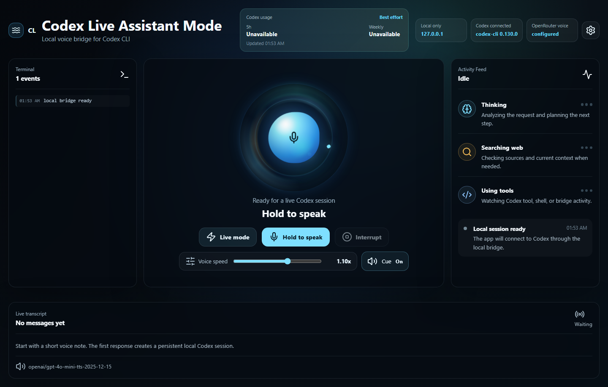
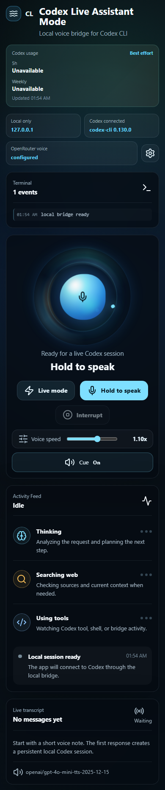
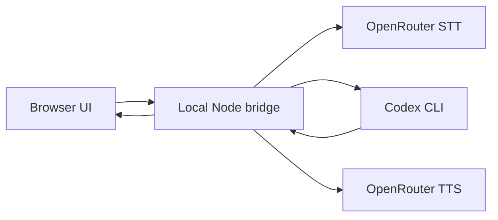

# Codex Live Assistant Mode

Unofficial local voice interface for Codex CLI.

Codex Live Assistant Mode turns a local Codex CLI session into a voice-first assistant. The browser records your voice, the local Node bridge sends audio to OpenRouter for STT, the transcript goes to Codex CLI, live activity is streamed back to the UI, and the final answer is spoken through OpenRouter TTS.

This project is not affiliated with OpenAI.

## Screenshots





## Features

- Localhost-only React interface.
- Push-to-talk and experimental Live Mode.
- Browser-side silence detection with correction barge-in.
- OpenRouter speech-to-text and text-to-speech adapters.
- Persistent local Codex CLI session bridge.
- Read-only Codex sandbox posture by default.
- Live activity timeline for thinking, expected web search, tool use, terminal events, and answer preparation.
- Chunked TTS playback so speech can start sooner.
- Speech cleanup that avoids reading raw links and code blocks aloud.
- Settings modal for voice, OpenRouter, Codex model, reasoning effort, workspace, sessions, and logout.
- Codex usage card backed by the official local Codex app-server rate-limit protocol when available.

## Requirements

- Node.js 22 or newer.
- Codex CLI installed and logged in locally.
- An OpenRouter API key for STT/TTS.

Check Codex locally:

```bash
codex --version
codex login status
```

## Setup

```bash
npm install
cp .env.example .env
npm run dev
```

On Windows PowerShell:

```powershell
Copy-Item .env.example .env
npm run dev
```

Then open:

```text
http://127.0.0.1:5173
```

## Configuration

Set these in `.env`, or use the Settings modal for local app settings:

```env
OPENROUTER_API_KEY=
OPENROUTER_STT_MODEL=openai/gpt-4o-transcribe
OPENROUTER_STT_LANGUAGE=
OPENROUTER_TTS_MODEL=openai/gpt-4o-mini-tts-2025-12-15
OPENROUTER_TTS_VOICE=nova
OPENROUTER_TTS_SPEED=1.1
CODEX_MODEL=gpt-5.5
CODEX_REASONING_EFFORT=xhigh
CODEX_ENABLE_SEARCH=true
HOST=127.0.0.1
PORT=8787
```

OpenRouter model IDs and availability can change. Use model IDs from your own OpenRouter dashboard.

Local settings are stored in `.local/settings.json`, which is ignored by git. API keys are never echoed back from settings or health endpoints.

## Architecture

See [docs/architecture.md](docs/architecture.md) for the full Mermaid diagram.

Short version:



## Security Model

The default server binds to `127.0.0.1`. This is intended for local use, not as a public hosted web app.

The Codex bridge starts Codex in read-only mode for new sessions:

```bash
codex --search --ask-for-approval never exec --json --sandbox read-only --skip-git-repo-check
```

The app does not read, copy, or parse Codex auth tokens, raw credential files, SQLite logs, browser cookies, or global state. Codex auth remains owned by the local Codex CLI.

Usage limits are read through the local Codex app-server `account/rateLimits/read` protocol. If that official surface fails or is unavailable, the UI links to the Codex usage dashboard instead of guessing.

Ignored local data:

- `.env`
- `.local/`
- `.playwright-cli/`
- `dist/`
- `node_modules/`

## Local Session Data

The app stores local session metadata under `.local/`. Codex session persistence remains handled by Codex itself.

## Limitations

- This is a turn-based live assistant, not a true realtime streaming voice stack.
- STT and TTS quality depend on your selected OpenRouter models.
- Codex JSON event formats may evolve; the activity feed normalizes events instead of showing raw payloads.
- Codex remaining usage limits depend on the official app-server rate-limit protocol. If unavailable, the app shows a safe dashboard fallback.
- Write-capable workspace mode is intentionally out of scope for the first public version.

## Troubleshooting

On Windows, if clicking an old Codex notification opens an Electron
`type=click&tag=...` error dialog, see
[docs/windows-notifications.md](docs/windows-notifications.md). The bridge
disables notifications for its own Codex child processes, but stale/global
Codex Desktop notifications may still need to be cleared or disabled locally.

## Disclaimer

This app can be useful for reflection, planning, research, and coding help. It is not therapy, medical care, emergency support, or a replacement for professional help.

## License

MIT
