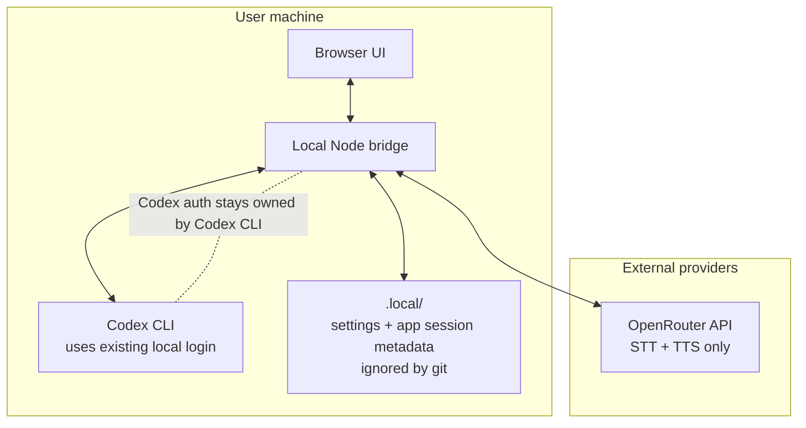

# Architecture

Codex Live Assistant Mode is a local bridge between browser voice I/O, OpenRouter audio models, and the user's local Codex CLI auth/session.

```mermaid
flowchart LR
  User((User))

  subgraph Browser["Browser UI"]
    Mic["Mic recorder\nLive Mode VAD"]
    Transcript["Transcript"]
    Activity["Activity feed\nstage cards + terminal"]
    Audio["Audio playback\nbarge-in"]
    UsageCard["Usage card\nbest effort"]
  end

  subgraph Bridge["Local Node bridge\n127.0.0.1 only"]
    TranscribeAPI["/api/transcribe"]
    CodexAPI["/api/codex/message\nNDJSON stream"]
    SpeechAPI["/api/speech"]
    UsageAPI["/api/codex/usage"]
    SettingsAPI["/api/settings\n/api/sessions"]
    Heartbeat["bridge heartbeat\nexpected search/tool stage"]
    Sessions[".local/sessions.json\n.local/settings.json"]
  end

  OpenRouterSTT["OpenRouter STT\nopenai/gpt-4o-transcribe"]
  OpenRouterTTS["OpenRouter TTS\nopenai/gpt-4o-mini-tts-2025-12-15"]
  CodexCLI["Codex CLI\nlocal auth\npersistent session\nread-only sandbox"]

  User -- speech --> Mic
  Mic -- audio blob --> TranscribeAPI
  TranscribeAPI -- transcription request --> OpenRouterSTT
  OpenRouterSTT -- transcript text --> TranscribeAPI
  TranscribeAPI -- user text --> Transcript
  Transcript -- prompt + session id --> CodexAPI
  CodexAPI -- exec --json --> CodexCLI
  CodexCLI -- JSONL events + final answer --> CodexAPI
  Heartbeat -- expected stage updates --> Activity
  CodexAPI -- activity + terminal + final --> Activity
  CodexAPI -- final answer --> SpeechAPI
  SpeechAPI -- TTS request --> OpenRouterTTS
  OpenRouterTTS -- audio --> SpeechAPI
  SpeechAPI -- chunked playback audio --> Audio
  Audio -- spoken answer --> User
  UsageAPI -- official CLI status only --> CodexCLI
  UsageAPI -- unavailable if not exposed --> UsageCard
  SettingsAPI <--> Sessions
```

## Trust Boundaries



## Default Safety Model

- The server binds to `127.0.0.1`.
- The repository never stores provider keys.
- Codex auth tokens are not read, copied, parsed, or transformed by the app.
- Usage limits are not guessed from private files. If Codex CLI does not expose them safely, the UI says `Unavailable`.
- Codex runs in read-only sandbox mode for new sessions.
- Session metadata is stored under `.local/`, which is ignored by git.
